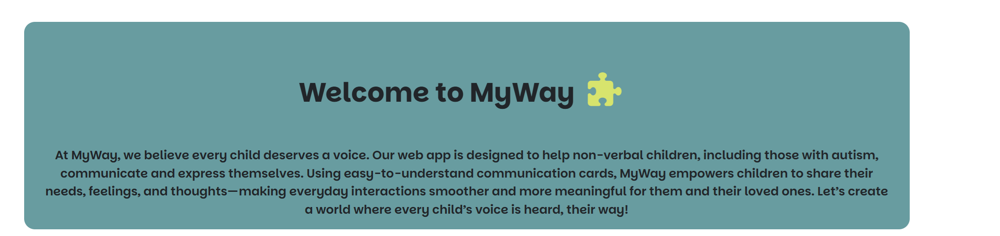
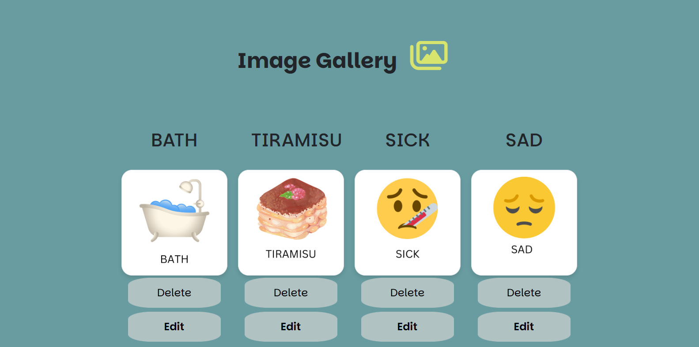
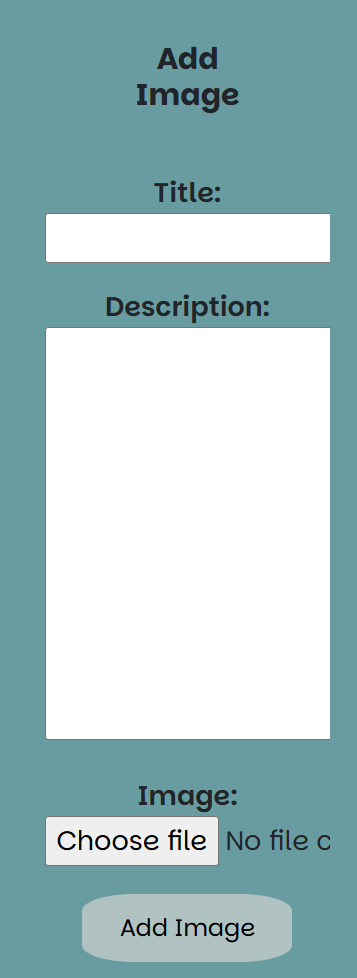
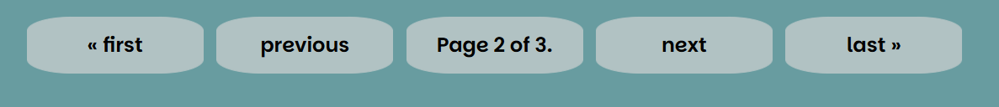
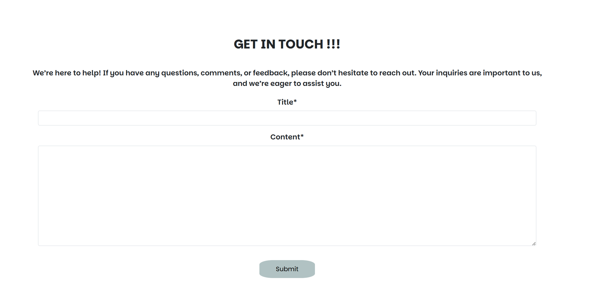
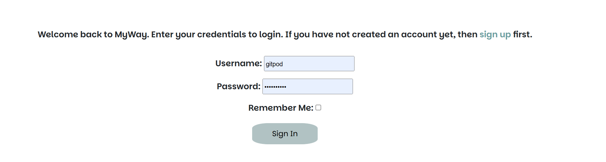
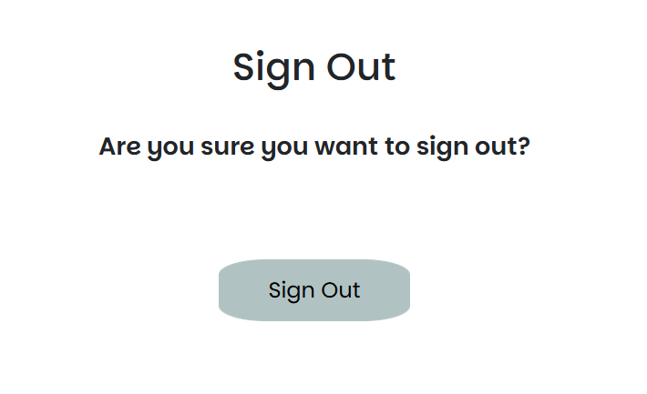
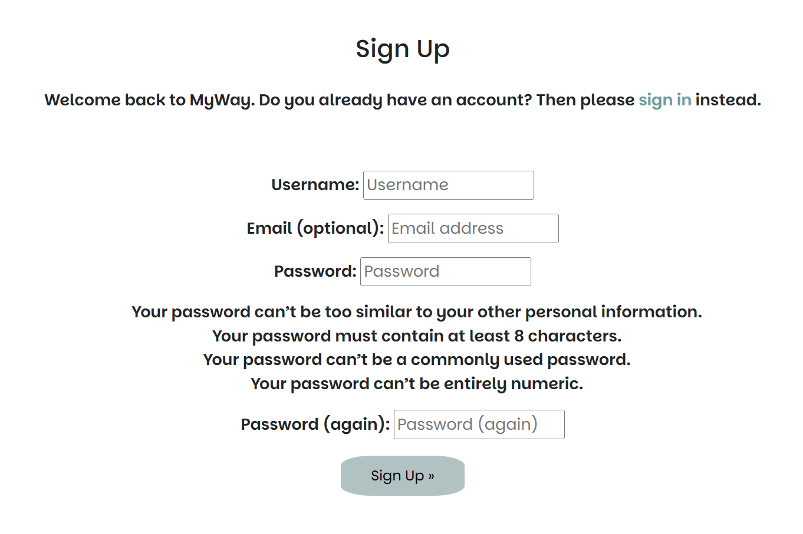
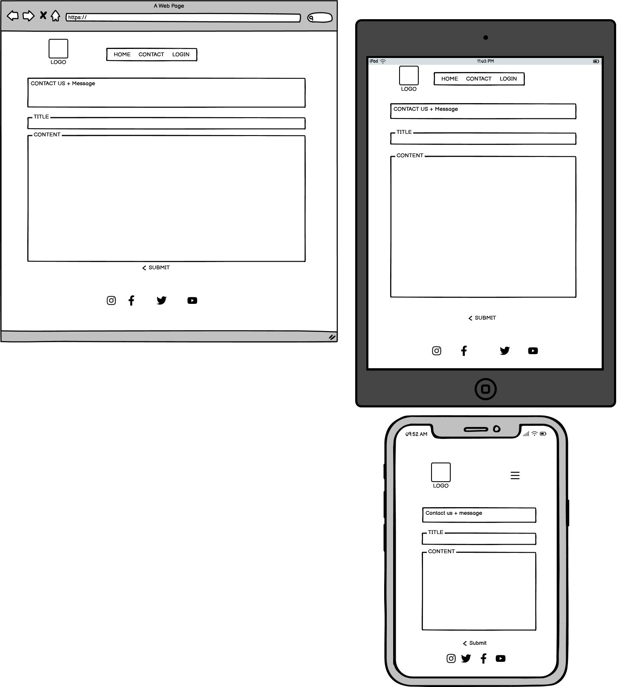

# Introduction

## Live site link here

## Repository link here

## Table of contents

 1. [ UX ](#ux)
 2. [ Technologies and Tools ](#technologies)    
 3. [ Research ](#research) 
 4. [ Target Audience ](#audience)  
 5. [ User Stories ](#user)
 6. [ Planning, Structure and Design ](#design)
     - [ Iterations ](#iterations)
     - [ Layout ](#layout)
     - [ Features ](#features)
     - [ Design Choices ](#designchoice)
     - [ Wireframes ](#wireframes)
     - [ Database ](#database)
        - [ Entity Relationship Diagram ](#erd) 
 7. [ Deployment ](#deployment)
 8. [ Testing/Bugs/Fixes ](#testing)
 9. [ Media ](#media)
 10. [ Credits ](#credit)  

## UX 

### Technologies and Tools Used 

 Technologies 

* Languages

    * HTML
    * CSS
    * JavaScript
    * Python
    * DTL - Django Template Language

* Version Control

    * Git
    * Github
    * Gitpod
    * Heroku

* Frameworks

    * Django
    * Bootstrap

* Database

    * PostgreSQL

* Additional resources

    * Coolors: https://coolors.co/ 
    * Canva: https://www.canva.com/
    * FontAwesome: https://fontawesome.com/search?o=r&m=free&s=solid
    * Perplexity: perplexity.ai
    * ChatGPT: https://chat.openai.com/
    * Google Fonts: https://fonts.google.com/
    * W3School: https://www.w3schools.com/

* Testing

    * Google Lighthouse
    * JSHint: https://jshint.com/
    * JSLint: https://www.jslint.com/
    * W3C HTML Validator: https://validator.w3.org/
    * W3C CSS Validator: https://jigsaw.w3.org/css-validator/

### Research 

### Target Audience 

* This app is made for children who cannot speak, including those with autism, speech delays, or other challenges. It helps them express their needs, feelings,
 and thoughts using simple communication or picture cards. The app also supports parents, caregivers, and teachers by making it easier to communicate and connect with these children.

### User Stories 

 USER STORIES 

* User story 1:

    - As a user, I want to view an introduction section explaining the purpose of the app:

    1. Acceptance criteria : when the site is loaded, the user is presented with an introduction explaining the purpose of the site.

* User story 2:

    - As a user, I want to upload, edit, and delete images in the gallery so that I can manage my content:
    
    1. Acceptance criteria : I can upload a new image to the gallery.
    2. Acceptance criteria : An unwanted image can be removed/deleted from the gallery.
    3. Acceptance criteria : I can edit/replace the image and or it's title.

* User story 3:

    - As a user, I want to view the image gallery in a paginated format to navigate easily.
    
    1. Acceptance criteria : when the site is loaded, an image gallery is available with communication cards.
    2. Acceptance criteria : the images are displayed in a paginated format.

* User story 4:

    - As a user, I want to select up to 3 images from the gallery to showcase in a special section.
    
    1. Acceptance criteria : A section is available with empty image slots for communication.
    2. Acceptance criteria : When the slots are clicked the images tore is available to choose desired image from. 

* User story 5: 

    - As a user, I want to remove images from the showcase section so that I can update it as needed.
    
    1. Acceptance criteria : When all slots are filled the image can be removed/replaced. 

* User story 6:

    - As a user, I want authentication features so that I can log in, sign up, and manage content securely.
    
    1. Acceptance criteria : When visiting the site, a login link is available to submit my details
    2. Acceptance criteria : A register link is available to sign up as a new user.
    3. Acceptance criteria : When a user logs in, previously selected images are available in the Display section. 

* User story 7:

    - As a user, I want to view a contact page header with an image and description.
    
    1. Acceptance criteria : when visiting the site, a contact link is available in navigation bar and is presenting a contact form for the user. 

* User story 8:

    - As a user, I want to fill out a contact form with my name, email, and message
    
    1. Acceptance criteria : visiting the contact page should present a form that is sent for admin review.

* User story 9:

    - As an admin, I want to view submitted contact form entries in the admin panel.
    
    1. Acceptance criteria : AS an admin I should be seeing submitted contact requests.

## Planning, Structure and Design 

### Iterations 

#### MoSCoW Prioritization

| **User Story** | **Story Points** | **Priority** | **Notes** |
|-------------|-----------------|-----------------|-------------|
| 1. Introduction Section | 2 | Must Have | Static content- introduction |
| 2. Gallery Managemennt | 8 | Must Have | Full CRUD Functionality for managing images |
| 3. View Image Gallery | 5 | Must Have | Paginated image display |
| 4. Display Section | 8 | Must Have | Communication board to showcase selected images |
| 5. Update Display | 3 | Must Have | Remove and Add images in Display section |
| 6. Authentication | 5 | Should Have | Should have authentication using Django's AllAuth |
| 7. Contact Page | 3 | Could Have | Static contact for contact information |
| 8. Contact Form | 5 | Could Have | Saves form entries to database |
| 9. Contact Page Admin | 3 | Could Have | Admin view for enquiries |

#### Iterations Summary

| **Iteration** | **Features** | **Story Points** | **MoSCoW Focus** |
|-------------|-----------------|-----------------|-------------|
| Iteration 1 | Introduction, Gallery Managment and Image Gallery | 15 | Must Have |
| Iteration 2 | Display Section,Update Display and Authentication | 16 | Must Have and Should Have |
| Iteration 3 | Contact Page , Form and Admin | 11 | Could Have |

### Layout: 

### Design Choices: 

* Colors: Coolors (https://coolors.co/) palette generator was used on the logo designed to pick the below colors for the project. 

-  #C7DA31  - PEAR
-  #B1C2C3  - ASH GREY
-  #689CA0  - MOONSTONE
-  #FFFFFF  - WHITE
-  #D7E46D  - MINDARO

* Font family: 

- I picked the "Parkinsans" font family with san-serif as a fall back.

### Features: 

1. 

Header

- Logo : designed using Canva
- Navigation/Burger Icon: navigation links to all pages in the app or toggle icon on smaller devices. 

2. 

Introduction

- Text-based section with an Introduction written about the application.

3. 

Communication board

- Written in HTML to include 3 empty image slots. 
- Include a reset button designed to delete image selection and reset to the default 3 empty slots.
- Functionality is implemented using JavaScript

4. 

Image Gallery

- A collection of images displayed in a paginated format.
- Pagination is implemented with Django's views using python. 

5. 

Add Image

- Add image section is inbedded with the image gallery to create full CRUD functionality. IT is implemented using Django's forms written in python.

6. 

Pagination controls

- Pagination is implemented through the Django's views written is python combined with html in django's templates and JavaScript for enhanced functionalities. 
- It provides simple next/previous as well as first/last buttons for larger image stores.

7. 

Contact Page

- The contact page is to allow users a way to submit enquiries/suggestions/feedback about the site through a form that saves the details to the database and can be reviewed by
superusers through Django's admin page.

8. 

Footer

- Footer is designed in the base template to ensure consistency throughout the app.
- It is consist of a selection of social links.

9. 

Registration

- Django's built in AllAuth used to create the registration and corresponding login and logout features.
- Login feature page also provides a link to "sing up", which will direct the user to the registration page.
- Remember me option is provided on the login page.

### Wireframes: 

-   

 Wireframes: Home 

    
    

-   

 Wireframes: Contact 

    
    

### Database: 

#### Entity Relationship Diagram: 

## Deployment 

## Testing/Bugs/Fixes 

- Please see [TESTING.md](TESTING.md) for full manual and automated testing.

Notes for testing: this section is to be moved to TESTING>MD at the end of the project.

Bugs found during development:
1. delete and edit functions direct back to the top of the page:

- solution: JavaScript added to implement required functionality.

2. edit function when triggered overwrites pagination and image gallery gets out of context.

- solution: following code was addedmodified to rectify the issue. in communication/views.py 
if request.method == 'POST':
        form = ImageForm(request.POST, request.FILES, instance=image)

        if form.is_valid():
            form.save()
            messages.success(request, "Image updated successfully!")

            # Set session flag to scroll to image gallery
            request.session['scrollToImageGallery'] = True

            # Redirect to the gallery section with page number
            url = reverse('communication_home') + f'?page={page_number}#image-gallery'
            return redirect(url)
        else:
            messages.error(request, "Failed to update image. Please try again.")
    else:
        form = ImageForm(instance=image)

    paginator = Paginator(queryset, 4)
    page_obj = paginator.get_page(page_number)

3. add image section is not fitting in well with the design and pushes other elements out of place.

4. main section pushed out of alignment.

issue found: style.css , section styling's width settings coused the issue.

solution: removed styling to re-align elements.

5. Django messages out of alignment. : 
Solution: text-center class added to div with id="msg"

6. Add Image section squashed above 425px.

7. Register section: username, email and input fields should be in different rows under 425px.

8. Login section: username, email and password fields should be displayed inn seperate rows under 425px.

## Media 

## Credits 

## Acknowledgement
            
