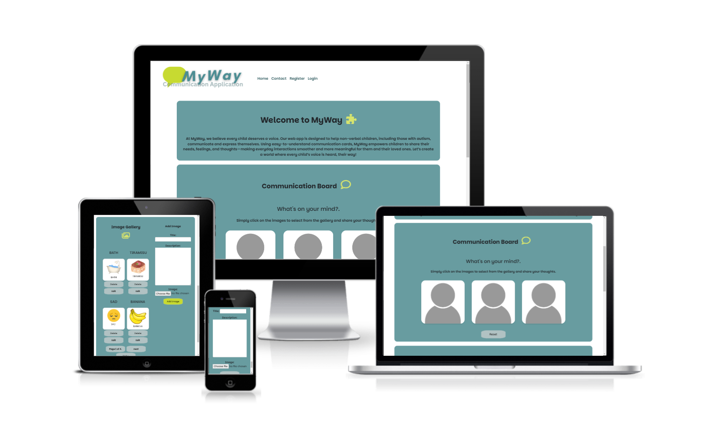
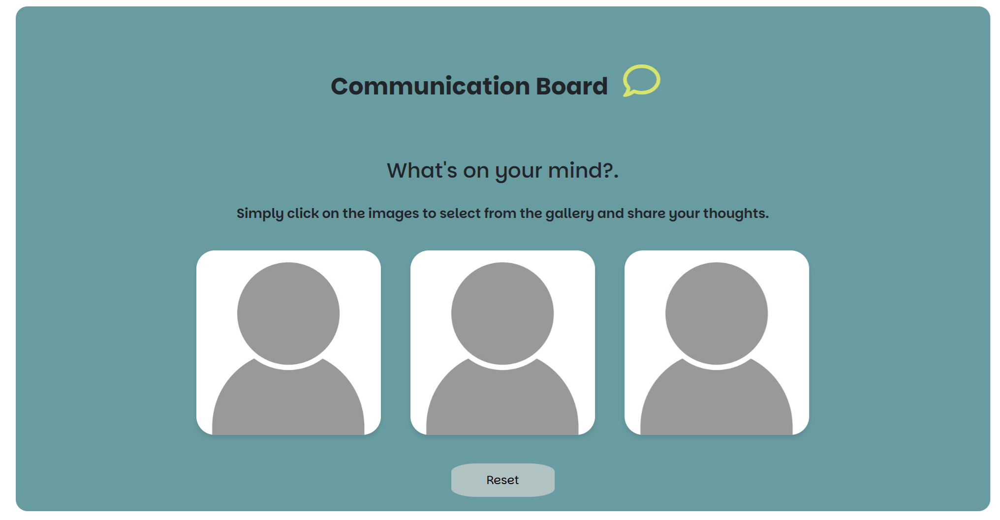

# Introduction

At MyWay, we believe every child deserves a voice. This belief stems from my personal journey as an uncle to two autistic nephews, one of whom is completely non-verbal. Watching him find joy in playing and watching videos on his tablet inspired this idea—it’s always within reach, making it the perfect tool to help him communicate.

Currently, his communication relies on a physical book filled with specialized cards, but these wear out quickly and constantly need replacing. I wanted to create a more durable and modern alternative, so I designed MyWay—a web app that uses easy-to-understand communication cards to empower non-verbal children to express their needs, feelings, and thoughts.

With MyWay, we aim to make everyday interactions smoother and more meaningful for children and their loved ones, creating a world where every child’s voice is heard—in their own way.

## **[MyWay Live Site](https://myway-01051f188b2e.herokuapp.com/)**

## **[MyWay REPOSITORY](https://github.com/ZoltanSzarvas0209/mp3_MyWay.git)**

## Table of contents

 1. [ UX ](#ux)
 2. [ Technologies ](#tech)    
 3. [ Target Audience ](#audience)  
 4. [ User Stories ](#user)
 5. [ Planning, Structure and Design ](#design)
     - [ Iterations ](#iterations)
     - [ Layout ](#layout)
     - [ Features ](#features)
     - [ Design Choices ](#designchoice)
     - [ Wireframes ](#wireframes)
     - [ Database ](#database)
     - [ Entity Relationship Diagram ](#erd) 
 6. [ Deployment ](#deployment)
 7. [ Testing/Bugs/Fixes ](#testing)
 8. [ Future Upgrades ](#upgrade)
 9. [ Credits ](#credit)  

## UX 

## Technologies 

 Technologies 

* Languages

    * HTML
    * CSS
    * JavaScript
    * Python
    * DTL - Django Template Language

* Version Control

    * Git
    * Github
    * Gitpod
    * Heroku

* Frameworks

    * Django
    * Bootstrap

* Database

    * PostgreSQL

* Additional resources

    * Coolors: https://coolors.co/ 
    * Canva: https://www.canva.com/
    * FontAwesome: https://fontawesome.com/search?o=r&m=free&s=solid
    * Perplexity: perplexity.ai
    * ChatGPT: https://chat.openai.com/
    * Google Fonts: https://fonts.google.com/
    * W3School: https://www.w3schools.com/

* Testing

    * Google Lighthouse
    * JSHint: https://jshint.com/
    * JSLint: https://www.jslint.com/
    * W3C HTML Validator: https://validator.w3.org/
    * W3C CSS Validator: https://jigsaw.w3.org/css-validator/

## Target Audience 

* This app is made for children who cannot speak, including those with autism, speech delays, or other challenges. It helps them express their needs, feelings,
 and thoughts using simple communication or picture cards. The app also supports parents, caregivers, and teachers by making it easier to communicate and connect with these children.

### User Stories 

 USER STORIES 

* User story 1:

    - As a user, I want to view an introduction section explaining the purpose of the app:

    1. Acceptance criteria : when the site is loaded, the user is presented with an introduction explaining the purpose of the site.

* User story 2:

    - As a user, I want to upload, edit, and delete images in the gallery so that I can manage my content:
    
    1. Acceptance criteria : I can upload a new image to the gallery.
    2. Acceptance criteria : An unwanted image can be removed/deleted from the gallery.
    3. Acceptance criteria : I can edit/replace the image and or it's title.

* User story 3:

    - As a user, I want to view the image gallery in a paginated format to navigate easily.
    
    1. Acceptance criteria : when the site is loaded, an image gallery is available with communication cards.
    2. Acceptance criteria : the images are displayed in a paginated format.

* User story 4:

    - As a user, I want to select up to 3 images from the gallery to showcase in a special section.
    
    1. Acceptance criteria : A section is available with empty image slots for communication.
    2. Acceptance criteria : When the slots are clicked the image store is available to choose desired image from. 

* User story 5: 

    - As a user, I want to remove images from the showcase section so that I can update it as needed.
    
    1. Acceptance criteria : When all slots are filled the image can be removed/replaced. 

* User story 6:

    - As a user, I want authentication features so that I can log in, sign up, and manage content securely.
    
    1. Acceptance criteria : When visiting the site, a login link is available to submit my details
    2. Acceptance criteria : A register link is available to sign up as a new user.
    3. Acceptance criteria : When a user logs in, previously selected images are available in the Display section. 

* User story 7:

    - As a user, I want to view a contact page header with an image and description.
    
    1. Acceptance criteria : when visiting the site, a contact link is available in navigation bar and is presenting a contact form for the user. 

* User story 8:

    - As a user, I want to fill out a contact form with my name, email, and message
    
    1. Acceptance criteria : visiting the contact page should present a form that is sent for admin review.

* User story 9:

    - As an admin, I want to view submitted contact form entries in the admin panel.
    
    1. Acceptance criteria : AS an admin I should be seeing submitted contact requests.

## Planning, Structure and Design 

### Iterations 

#### MoSCoW Prioritization

| **User Story** | **Story Points** | **Priority** | **Notes** |
|-------------|-----------------|-----------------|-------------|
| 1. Introduction Section | 2 | Must Have | Static content- introduction |
| 2. Gallery Managemennt | 8 | Must Have | Full CRUD Functionality for managing images |
| 3. View Image Gallery | 5 | Must Have | Paginated image display |
| 4. Display Section | 8 | Must Have | Communication board to showcase selected images |
| 5. Update Display | 3 | Must Have | Remove and Add images in Display section |
| 6. Authentication | 5 | Should Have | Should have authentication using Django's AllAuth |
| 7. Contact Page | 3 | Could Have | Static contact for contact information |
| 8. Contact Form | 5 | Could Have | Saves form entries to database |
| 9. Contact Page Admin | 3 | Could Have | Admin view for enquiries |

#### Iterations Summary

| **Iteration** | **Features** | **Story Points** | **MoSCoW Focus** |
|-------------|-----------------|-----------------|-------------|
| Iteration 1 | Introduction, Gallery Managment and Image Gallery | 15 | Must Have |
| Iteration 2 | Display Section,Update Display and Authentication | 16 | Must Have and Should Have |
| Iteration 3 | Contact Page , Form and Admin | 11 | Could Have |

### Layout: 

### Design Choices: 

* Colors: Coolors (https://coolors.co/) palette generator was used on the logo designed to pick the below colors for the project. 

-  #C7DA31  - PEAR
-  #B1C2C3  - ASH GREY
-  #689CA0  - MOONSTONE
-  #FFFFFF  - WHITE
-  #D7E46D  - MINDARO
-  #305B5F  - color added to improve contrast of navigation links.

* Font family: 

- I picked the "Parkinsans" font family with san-serif as a fall back.

### Features: 

1. 

Header

- Logo : designed using Canva
- Navigation/Burger Icon: navigation links to all pages in the app or toggle icon on smaller devices. 

2. 

Introduction

- Text-based section with an Introduction written about the application.

3. 

Communication board

- Written in HTML to include 3 empty image slots. 
- Include a reset button designed to delete image selection and reset to the default 3 empty slots.
- Functionality is implemented using JavaScript

4. 

Image Gallery

- A collection of images displayed in a paginated format.
- Pagination is implemented with Django's views using python. 

5. 

Add Image

- Add image section is inbedded with the image gallery to create full CRUD functionality. IT is implemented using Django's forms written in python.

6. 

Pagination controls

- Pagination is implemented through the Django's views written is python combined with html in django's templates and JavaScript for enhanced functionalities. 
- It provides simple next/previous as well as first/last buttons for larger image stores.

7. 

Contact Page

- The contact page is to allow users a way to submit enquiries/suggestions/feedback about the site through a form that saves the details to the database and can be reviewed by
superusers through Django's admin page.

8. 

Footer

- Footer is designed in the base template to ensure consistency throughout the app.
- It is consist of a selection of social links.

9. 

Registration

- Django's built in AllAuth used to create the registration and corresponding login and logout features.
- Login feature page also provides a link to "sing up", which will direct the user to the registration page.
- Remember me option is provided on the login page.

### Wireframes: 

-   

 Wireframes: Home 

    
    

-   

 Wireframes: Contact 

    
    

### Database: 

- A relational database, PostgreSQL was chosen for the project because it provides a structured way to store and manage data in tables with clearly defined relationships. This structure ensures data consistency and makes querying straightforward, which is essential for features like managing public image uploads, storing contact messages, and potentially scaling to user-specific functionalities.

### Entity Relationship Diagram: 

- The User model, integrated using Django's AllAuth, demonstrates user registration and authentication capabilities. At this stage, no custom user data is added, serving purely as a showcase of the system's extensibility for user management.

- The Image model is independent and serves as a public-facing feature. Anyone, whether a registered user or not, can upload images. Each uploaded image is stored with metadata, including title, description, and image_url. This functionality is intended to demonstrate public interaction with the application and image management capabilities.

- The Contact model is also independent and public-facing. It allows anyone to send messages to the company, with fields for title, content, and an updated_on timestamp. Superusers can access and manage these messages, providing a means of direct communication with the company.

- 

 ERD 

    
    

## Deployment 

- I used Heroku to deploy this project.

- To deploy to Heroku:

1. in Gitpod CLI create your Procfile and make sure it contains the following line of code:   web: gunicorn myway.wsgi
   This tells Heroku how to run the application.
2. Login to Heroku, select 'Create New App', create a unique name for the app and select your nearest region. Click 'Create App'
3. Navigate to the Deploy tab on Heroku dashboard and select Github, search for your project's reposatory and click 'connect'.
4. Navigate to 'settings', click reveal config vars and input the Database and SECRET KEY KEY-VALUE pairs along with all other dependencies relevent to the project.
5. Go to the Deploy tab , scroll to Manual Deploy and clcik on 'Deploy branch'
6. Once build is complete click on 'View' to launch the new app

## Testing/Bugs/Fixes 

- Please see [TESTING.md](TESTING.md) for full manual and automated testing.

## Future Upgrades 

* Several features and ideas were identified and recommended for future increments that were out of the scope of the project.

1. Pop-up window , when images are selected for the Communication Board to confirm selection. This feature was trialed with simple HTML element with JavaScript functionality, however desired result was not achived during initial development.

2. Customised Profiles: While Django's Allauth authentication is implemented, at this stage it has no customised data linked to it. 
The Project has the potential to feature personalised profiles for users and capabilities to upload and manage customised image galleries.
This feature should also include a correspondence window, where messages submited through the app can be revisited.

3. It has come to my attention during development that while the app has the desied functionality, it is best applied in medium to large screen sizes and further responsivness could be applied to mobile devices to ease navigation and decreses current level of scrolling required. Proposed improvment would feture a functionality, where the Communication board's placeholder images can be clicked directly to present available images to choose from( rather then navigating between the image gallery and communication board section).

4. The application should be further improved with personalised routine boards to feuture daily/weekly/monthly schedules.

5. The Communication board should be enhanced with cathegory options such as feelings or activities.

## Credits 

* Following resources were used during the project:

- https://www.w3schools.com/  - was used to help with HTML and JavaScript ideas.

- CodeInstitute's Tutor Assistence - Assistence were used in a few occasion:
1. Cloudinary images are not rendered as intended.
2. Main section block is out of alignment.
3. Pop-up window - This feature was transfered for future improvement recommendation as no viabale solution was found within the available timeframe and project meets requirements without the feature.

- ChatGPT: This AI was used consistently, to help troubleshoot errors , refactor code , suggest improvements. - All dependencies are credited in comments.

            
