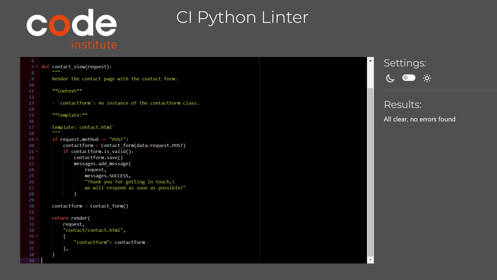
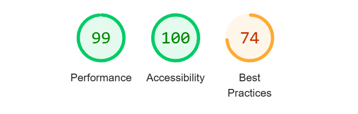

# MANUAL TESTING

### Testing Responsiveness

| **Feature** | **Test Method** | **Expectation** | **Outcome** |
|-------------|-----------------|-----------------|-------------|
| Header Responsivness | Developer Tools: 320px/375px/425px/768px/1024px/1440px | Fully Responsive Layout | PASS |
| Footer Responsiveness | Developer Tools: 320px/375px/425px/768px/1024px/1440px | Fully Responsive Layout| PASS |
| Introduction Section | Developer Tools: 320px/375px/425px/768px/1024px/1440px | Fully Responsive Layout| PASS |
| Image Gallery Section | Developer Tools: 320px/375px/425px/768px/1024px/1440px | Fully Responsive Layout| PASS |
| Communication Board Section | Developer Tools: 320px/375px/425px/768px/1024px/1440px | Fully Responsive Layout| PASS |
| Contact Section | Developer Tools: 320px/375px/425px/768px/1024px/1440px | Fully Responsive Layout| PASS |
| Register Section | Developer Tools: 320px/375px/425px/768px/1024px/1440px | Fully Responsive Layout| PASS |
| Login Section | Developer Tools: 320px/375px/425px/768px/1024px/1440px | Fully Responsive Layout| PASS | 
| Logout Section | Developer Tools: 320px/375px/425px/768px/1024px/1440px | Fully Responsive Layout| PASS | 

### Testing Functionality of Buttons/Links

| **Feature** | **Test Method** | **Expectation** | **Outcome** |
|-------------|-----------------|-----------------|-------------|
| Navigation Links | Click each link | Route to relevent page | PASS |
| Image Gallery - delete | click button | remove selected image | PASS |
| Image Gallery - edit | clcik button | fill "Add Image" section with details from selected image| PASS |
| Image Gallery - pagination controls | click all pagination buttons | next/previous/last/first buttons navigate to correvt page | PASS |
| Image Gallery - Add image | clcik add image button after with upload image section filled.| Image uploaded is added to Gallery| PASS |
| Image Gallery - Image/Schoose file | click on choose image | file browser pop up to select desired image | PASS |
| Image Gallery - image selection | clcik desired images in Gallery | image clicked is loaded in Communication board section| PASS |
| Communication Board - reset | click reset button | Images revert back to place holders in Communication Board Section | PASS | 
| Footer - Social links | click each social link | links should direct user to relevent page | PASS | 

### Testing Layout/Structure

| **Feature** | **Test Method** | **Expectation** | **Outcome** |
|-------------|-----------------|-----------------|-------------|
| Layout header | visual inspection | page/feature to appear as expected/designed | PASS |
| Layout footer | visual inspection | page/feature to appear as expected/designed | PASS |
| Layout Introduction Section | visual inspection | page/feature to appear as expected/designed | PASS |
| Layout Communication Board | visual inspection | page/feature to appear as expected/designed | PASS |
| Layout Image Gallery | visual inspection | page/feature to appear as expected/designed | PASS |
| Layout Image Gallery - Add Image | visual inspection | page/feature to appear as expected/designed | PASS |
| Layout Contact Us | visual inspection | page/feature to appear as expected/designed | PASS |
| Layout Register | visual inspection | page/feature to appear as expected/designed | PASS |
| Layout Login | visual inspection | page/feature to appear as expected/designed | PASS |
| Layout Logout | visual inspection | page/feature to appear as expected/designed | PASS |

### Form Validation testing

| **Feature** | **Test Method** | **Expectation** | **Outcome** |
|-------------|-----------------|-----------------|-------------|
| Contact Form | Enter invalid input: No Title | No submission allowed - "Please fill in this field response" | PASS |
| Contact Form | Enter invalid input: No Content | No submission allowed - "Please fill in this field response" | PASS |
| Contact Form | Enter valid input | Submission allowed - "confirmation feedback" | PASS |
| AddImage Form | Enter invalid input: No Title | No submission allowed - "Please fill in this field response" | PASS |
| AddImage Form | Enter invalid input: No file | No submission allowed - "Please select a file" | PASS |
| AddImage Form | Enter invalid input: No Content | No submission allowed - "Please fill in this field response" | FAIL |
| AddImage Form(2) | Enter invalid input: No Content | No submission allowed - "Please fill in this field response" | PASS |
| AddImage Form | Enter valid input | Submission allowed - "confirmation feedback message" | PASS |

- One test failed: AddImage with no content was successfully submitted:
    - Solution: description = models.TextField(blank=True, null=True) 
    The above line in the Image model allowes the filled to be left empty. This was removed and re-test had passed.

### Browser Testing

| **Feature** | **Test Method** | **Expectation** | **Outcome** |
|-------------|-----------------|-----------------|-------------|
| Google Chrome | non scripted test of features on desktop | full functionality and compatibility with browser | PASS |
| Google Chrome | non scripted test of features on mobile | full functionality and compatibility with browser | PASS |
| Microsoft Edge | non scripted test of features on desktop | full functionality and compatibility with browser | PASS |
| Microsoft Edge | non scripted test of features on mobile | full functionality and compatibility with browser | PASS |
| Samsung Internet | non scripted test of features on mobile | full functionality and compatibility with browser | PASS |

### TESTING USER STORIES

| **Feature** | **Test Method** | **Expectation** | **Outcome** |
|-------------|-----------------|-----------------|-------------|
| User Story 1 | visual checking | introduction section is available and clearly explains the purpose of the site. | PASS |
| User Story 2 | Upload a test image, edit said image and then delete it | all CRUD functionality working and easy to use | PASS |
| User Story 3 | visual inspection | image gallery available in a paginated format | PASS |
| User Story 4 | visual inspection for the communication board section and click images to test functionality | clciked images to appear on communication board | PASS |
| User Story 5 | click reset button to clear board. | communication board to reset to default placeholder images. | PASS |
| User Story 6 | Navigate to relevant pages, register a dummy account | able to register an account and login as | PASS |
| User Story 7 | visual inspection | contact page is available through navigation and is presenting a contact form | PASS |
| User Story 8 | fill in contact form with dummy information | feedback that message was sent to be presented to user | PASS |
| User Story 9 | Superuser feature, login to Djangos admin site | all message submitted available for review. | PASS |

- User story 6 , Criteria 3 is not fullfilled and is part of future improvement recommendations as it was out of the scope of this project.

# AUTOMATED TESTING

### HTML,CSS and JS validation

* HTML VALIDATION:    

W3C validators used for HTML and CSS and JsHint is used to validate JAvaScript.
    
-   
 
 Initial validation 

    
    

-   
 
 PASSED VALIDATION 

    
    

    1. trailing / from meta element removed.
    2. Alt atribute added to logo image.
    3. h1 element removed from article and added before it as section header.
    4. article element replaced with div element.

* CSS VALIDATION: 
    
-   
 
 PASSED VALIDATION 

    
    

    1. validation passed on first attempt.

* JavaScript VALIDATION: 
    
-   
 
 PASSED VALIDATION 

    
    

    1. validation passed on first attempt.

## PEP8 , python validation:

* Communication App:  No mayor errors, several whitespaces needed clearing, a few line of code were too long and some indentation needed adjusting.

-   
 
 PASSED VALIDATION forms.py 

    
    

-   
 
 PASSED VALIDATION models.py 

    
    

-   
 
 PASSED VALIDATION views.py 

    
    

* Contact App: Cleared validation

-   
 
 PASSED VALIDATION forms.py 

    
    

-   
 
 PASSED VALIDATION models.py 

    
    

-   
 
 PASSED VALIDATION views.py 

    
    

## Lighthouse 

-   
 
 INITIAL LIGHTHOUSE RESULTS 

    
    

-   
 
 IMPROVED LIGHTHOUSE RESULTS 

    
    

-   
 
 FINAL LIGHTHOUSE TESTS 

    
    

    1. refactored complete style.css file with the use of ChatGPT to completly eliminate unused and duplicate code.
    2. used https://coolors.co/contrast-checker/305b5f-ffffff to find more suitable color for navigation links to improve contrast.
    3. Best PRactises results came in low due to Cloudinary cookies and http , unsecure requests being used.
        - Following code was used in settings.py to force cloudinary to use https:
        import cloudinary
        cloudinary.config(secure=True)
